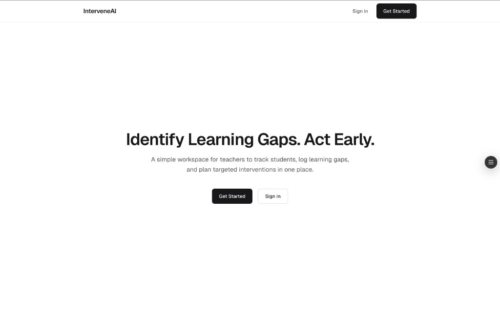
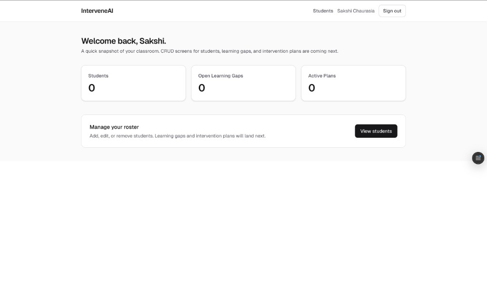
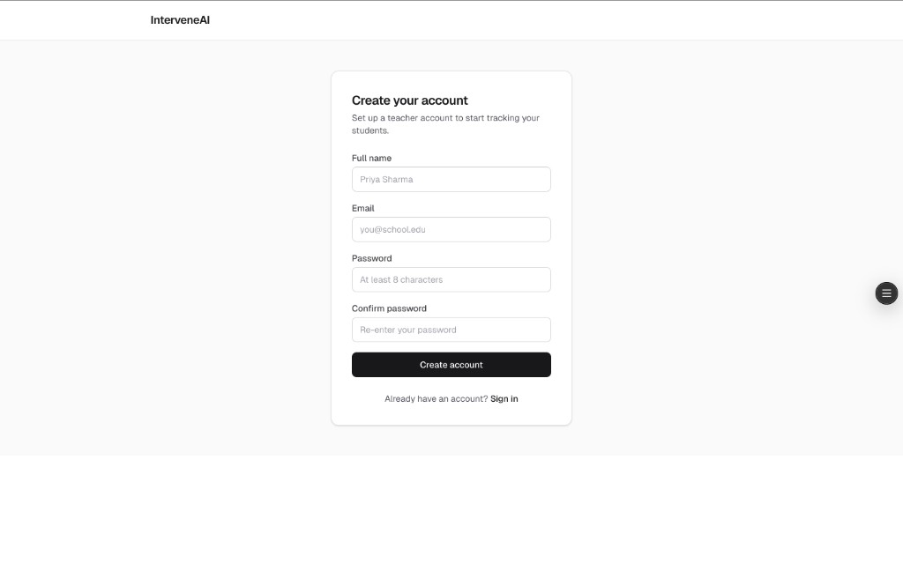
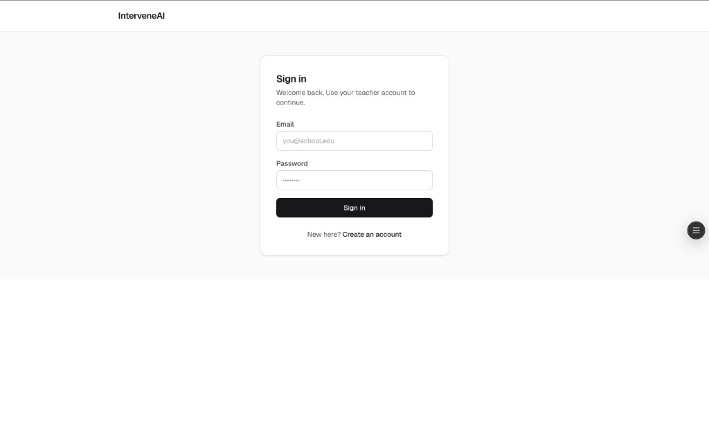
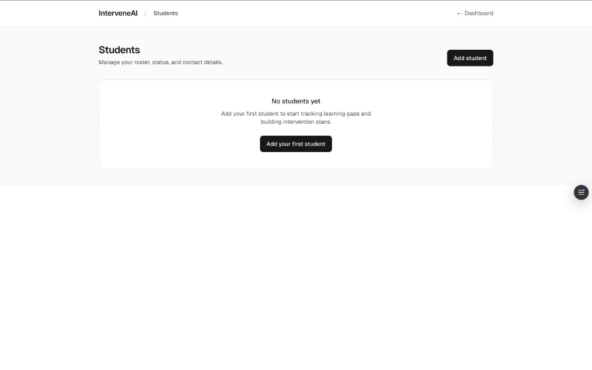
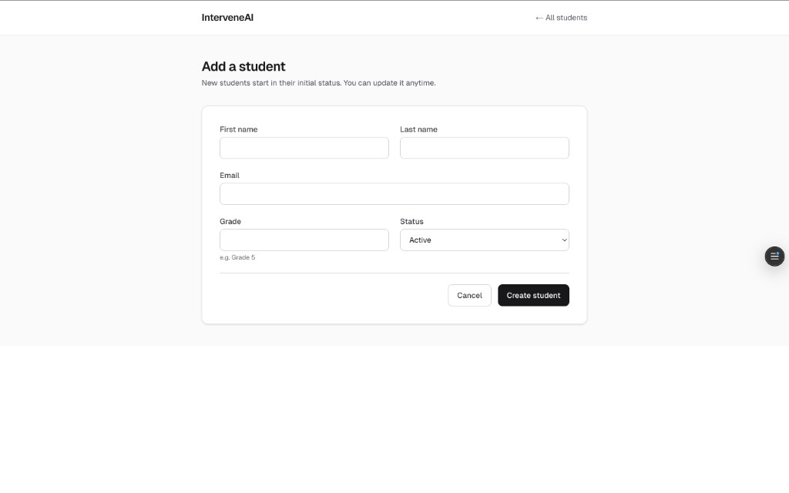

# InterveneAI

A small web app that helps teachers track student learning gaps and run intervention plans, without using a spreadsheet.

Built as a full-stack assignment. The brief asked for a CRUD dashboard with auth and a clean data model. I focused on getting the data shape right, scoping every query to the logged-in teacher, and keeping the UI quiet enough that a tired teacher can use it at the end of a school day.

## Live demo

- **App:** https://h-e-assignment.vercel.app/
- **Demo teacher** (seeded): `priya.sharma@interveneai.test` / `demo1234`
- Or sign up with any email at `/auth/signup`.

The demo teacher comes with four students, learning gaps, two intervention plans, and a couple of progress notes already populated, so you can review the full UX without entering data first.

### Screens

|  |  |
| --- | --- |
|  |  |
|  |  |
|  |  |

## What it does

A teacher signs in and lands on a dashboard with three numbers: how many students they have, how many learning gaps are still open across them, and how many intervention plans are currently active. From there:

- Add or edit a student (name, grade, status, email).
- For any student, log learning gaps with subject, severity (low / medium / high), and a short description. Status moves from `open` to `in_progress` to `resolved`.
- Create an intervention plan with a strategy, date range, and status (`draft`, `active`, `completed`, `cancelled`).
- Append progress notes to a plan over time. Notes are editable and deletable.
- Edit or delete anything you own. Nothing is shared between teachers.

That's the whole product surface: 11 protected routes and 5 models (`User`, `Student`, `LearningGap`, `InterventionPlan`, `ProgressNote`).

## Stack

- Next.js 16 (App Router), React 19, TypeScript
- Tailwind CSS v4
- PostgreSQL 16, Prisma 6
- NextAuth v4 (Credentials provider, JWT sessions, bcryptjs)
- React Hook Form + Zod (the same schema validates client and server)


## Local setup

You need Node 20+ and Docker (for the bundled local Postgres).

```bash
npm install
npm run db:up           # starts Postgres on localhost:5433
cp .env.example .env
openssl rand -base64 32 # paste output into NEXTAUTH_SECRET in .env
npm run prisma:migrate  # name the migration "init" when prompted
npm run db:seed         # creates the demo teacher and a few students
npm run dev
```

Open http://localhost:3000.

To stop and reset:

```bash
npm run db:down       # stop the Postgres container
npm run db:reset      # wipe the volume and restart
```

## Project layout

```
prisma/
  schema.prisma         models, enums, relations
  seed.ts               demo teacher, students, gaps, plans, notes

src/app/
  page.tsx              landing
  auth/                 signup + login
  dashboard/            protected routes; each has a colocated actions.ts
  api/auth/             NextAuth handler

src/components/
  forms/                RHF + Zod form components
  shared/               shared UI (DeleteActionButton, etc.)
  layout/               landing page sections
  students/, learning-gaps/, intervention-plans/, progress-notes/

src/lib/
  prisma.ts             Prisma client singleton (HMR-safe)
  auth.ts               NextAuth options
  auth-helpers.ts       requireTeacherId, requireOwnedStudent
  display/badges.ts     shared status labels and Tailwind tones
  validators/           one Zod schema per resource
```

## Scripts

| Command | What it does |
| --- | --- |
| `npm run dev` | Next.js dev server |
| `npm run build` | Production build (runs `prisma migrate deploy` first) |
| `npm run lint` | ESLint |
| `npm run db:up` | Start local Postgres |
| `npm run db:down` | Stop local Postgres |
| `npm run db:reset` | Wipe DB volume and restart |
| `npm run db:seed` | Seed demo data |
| `npm run prisma:migrate` | Create + apply a dev migration |
| `npm run prisma:studio` | Open Prisma Studio |

## Environment variables

| Variable | Purpose |
| --- | --- |
| `DATABASE_URL` | Postgres connection string. In production, point at your hosted DB. |
| `DIRECT_URL` | Same DB but without the connection pooler. Only used by `prisma migrate`. |
| `NEXTAUTH_SECRET` | Signs the NextAuth session JWT. |
| `NEXTAUTH_URL` | Public origin of the app. |

`.env.example` is checked in. `.env` is gitignored.

## Deployment

The app deploys to Vercel against any hosted Postgres. I used Supabase.

1. Set the four env vars above in the Vercel project. For Supabase, `DATABASE_URL` should be the **pooled** connection (port 6543, with `?pgbouncer=true&connection_limit=1`); `DIRECT_URL` should be the **session-pooler** or direct connection (port 5432).
2. The build script runs `prisma migrate deploy && next build`, so migrations apply on every deploy.
3. After the first successful deploy, sign up through the live UI to create your teacher account.

Built by [Sakshi Chaurasia](https://github.com/sakshi-292).

